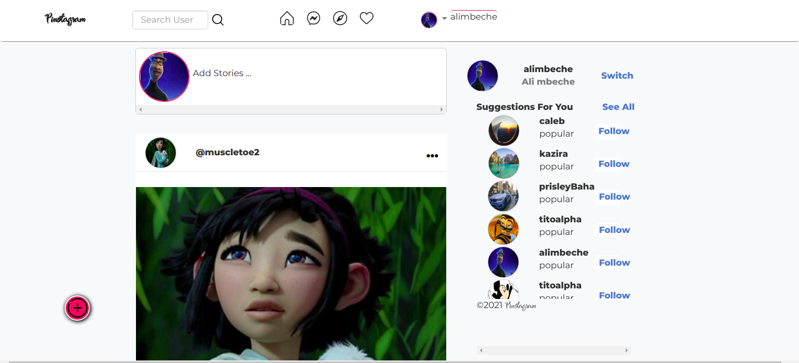
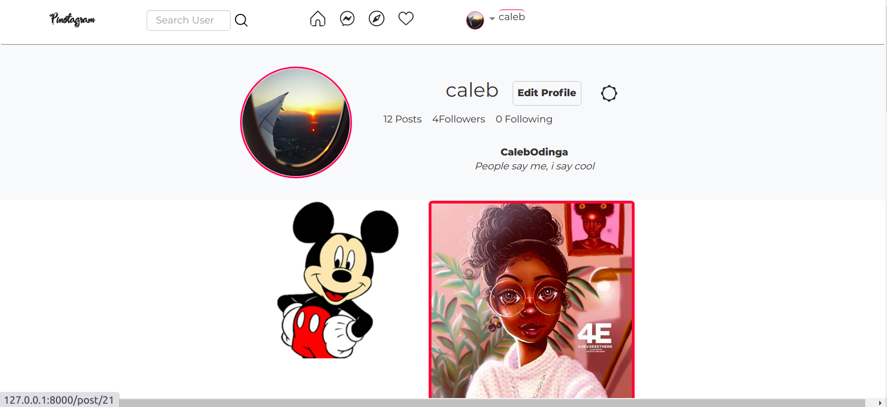
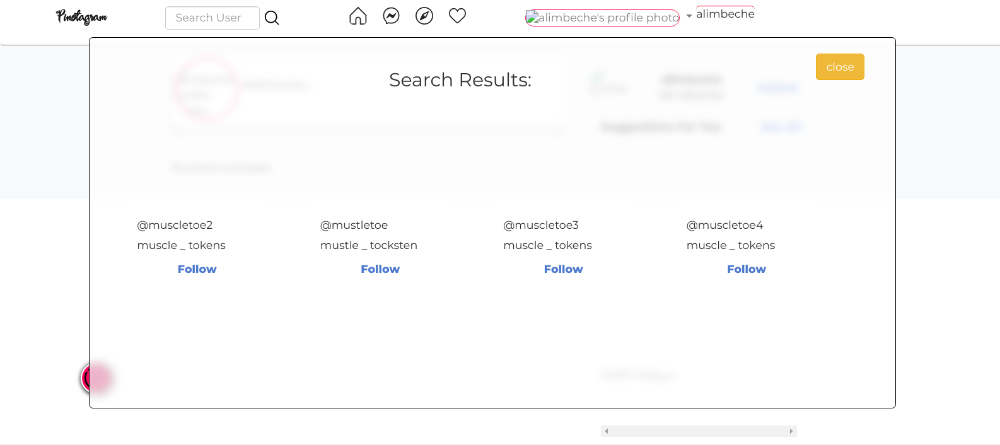
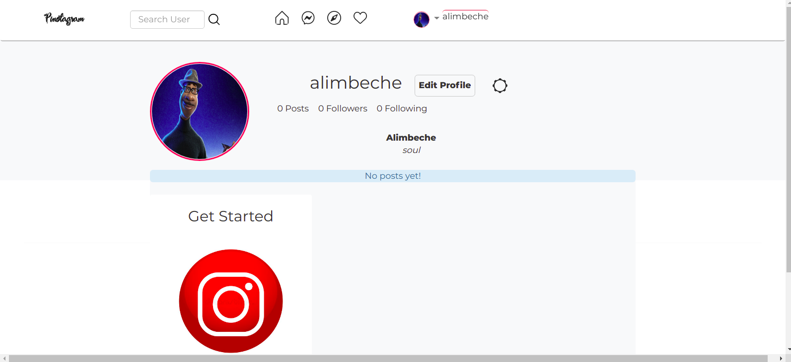

# Instagram_clone
This is a blog website where a user can share images of their interest. A user can can register, and login. Share a post or view posts, like a post, add a comment to the post and update their profie.

A user can view image details by clicking on the image. More images are shown on the homepage page and scroll down, latest first, oldest last.

Future releases to enable filtering a follow list suggestions.

# User journey.
A user visits the site. 
|_A user Registers to the website. 
  |_A user Logs in 
    |__A user sees images shared on the homepage. 
      |_A user likes an post image. 
      |-A user comments on a post image 
    |__A user searches for a other users 
    |_A user can follow other users 
    |_A user can open profile to update profile 
      |_A user can update profile 
    |_A user sees their own post 
    |_A user can add posts 
    |_A user can see their followers and followings 
  |-A user logs out and is redirected to login 

# Features to add
Real time display of comments and likes on homepage

# Output
A user selects a an image and can see its details.

A searches for users

A userrs number of followers and follows increase

# Homepage

# user posts

# Search results page

# Single Image

# user profile

# Installation
For correct version requirements installation, check the requirements.txt

Have Python installed in you machine.- the version used for this project is 3.8.5

install pip

install and activate virtual environment

install flask in the virtual environment < version used flask1.0.2 >

Use git, Github and any editor or IDE to see the codes and the rendered frontend.

The execution is done in terminal. Either computer Terminal or IDE terminal

# Usage
Ensure you have Python installed in your machine. Clone this github repository, git pull to your local machine and code away.

# Contributing
Pull requests are welcome. For major changes, please open an issue first to discuss what you would like to change.

Please make sure to update tests as appropriate.

# Website's link
This aplication is hosted heroku. Website Link is https://boiling-fjord-26135.herokuapp.com/

# License
This Website uses MIT LICENSE. For more Read License.

Copyright (c) 2021 Caleb Odinga